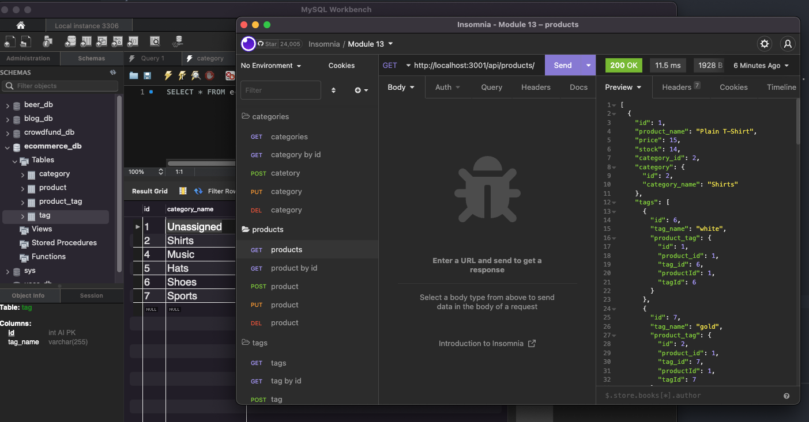

 
 

# E-Commerce API MVC

## Description

ExpressJS Routing API interface to mysql via sequelize.  Allows a front end to integrate to CRUD operations for an e-commerce store.  Uses Express, Mysql, Sequelize,.

## Table of Contents

- [Demo and Screen Shots](#demo)
- [Installation](#installation)
- [Usage](#usage)
- [Credits](#credits)
- [License](#license)
- [Questions](#questions)

## Demo
***

Demo:
[Demo Video Link](https://drive.google.com/file/d/1EsbJ8P3dso3t5wmnEEoTBxaoCmiFO8yj/view)

Screen Shot:

## Installation
***

Clone repository.  'npm i' in home directory.  Configure local .env file with DB_NAME, DB_USER, and DB_PASSWORD defined. Have a local mysql instance running.

## Usage
***

'npm run seed' to seed local database. 'node server.js' to start API server.  Run all CRUD routes on http://localhost:3001/api/\[categories\/tags\/products]. Individual objects by appending \/:id to end of GET request.

## Credits
 ***

[conradjohnson](https://github.com/conradjohnson)

 ## License
 ***

  ISC License

  [https://opensource.org/licenses/ISC](https://opensource.org/licenses/ISC)
  
  Permission to use, copy, modify, and/or distribute this software for any
  purpose with or without fee is hereby granted, provided that the above
  copyright notice and this permission notice appear in all copies.
  
  THE SOFTWARE IS PROVIDED "AS IS" AND THE AUTHOR DISCLAIMS ALL WARRANTIES WITH
  REGARD TO THIS SOFTWARE INCLUDING ALL IMPLIED WARRANTIES OF MERCHANTABILITY
  AND FITNESS. IN NO EVENT SHALL THE AUTHOR BE LIABLE FOR ANY SPECIAL, DIRECT,
  INDIRECT, OR CONSEQUENTIAL DAMAGES OR ANY DAMAGES WHATSOEVER RESULTING FROM
  LOSS OF USE, DATA OR PROFITS, WHETHER IN AN ACTION OF CONTRACT, NEGLIGENCE OR
  OTHER TORTIOUS ACTION, ARISING OUT OF OR IN CONNECTION WITH THE USE OR
  PERFORMANCE OF THIS SOFTWARE.
  
  Copyright (c) 2022 James Johnson
          

# Questions
***
For questions or assistance, please contact through [GitHub Account](https://github.com/conradjohnson) or email: [notmyemail@gmail.com](mailto:notmyemail@gmail.com)

 [Back to top](#description)